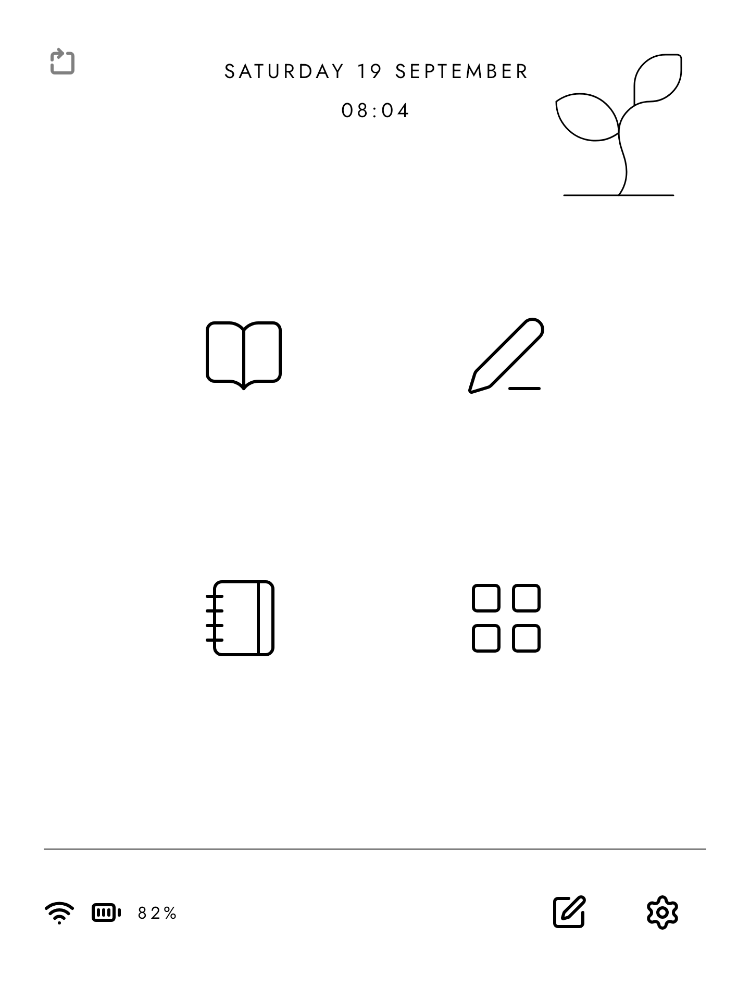
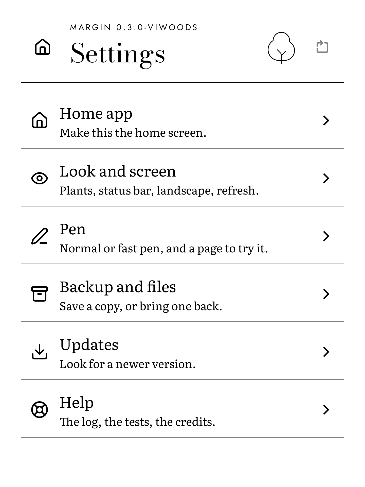
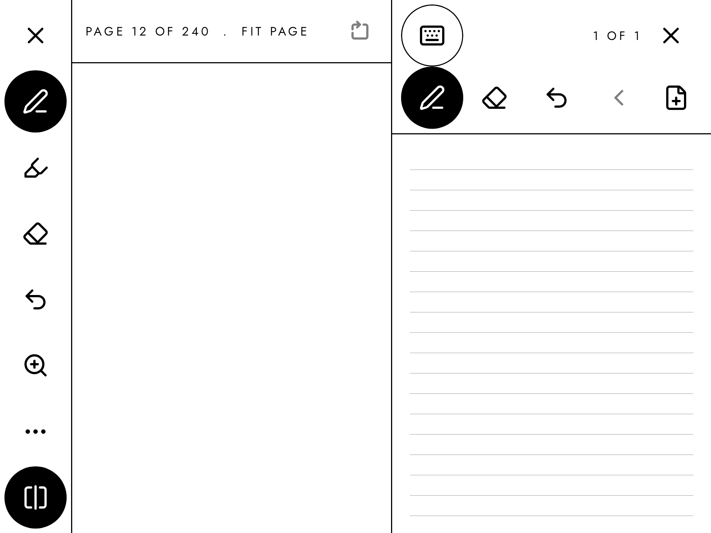

# Margin

[](https://github.com/FoxesRCool1/Margin-Eink-Launcher/releases/latest)
[](LICENSE)
[](https://github.com/FoxesRCool1/Margin-Eink-Launcher/actions/workflows/ci.yml)

**Turn your e-ink Android tablet into a place to read and write.**

Margin is a calm home screen (a launcher) for e-ink tablets. It has four
places to go: Read, Write, Journal and Apps. No animations, no scrolling,
black on white.

**[Download the free APK](https://github.com/FoxesRCool1/Margin-Eink-Launcher/releases/latest)**
· [How to install](#install)

Free and open source. Needs Android 10 or newer. Tested on the ViWoods
AiPaper Mini. Other tablets are not tested yet: see
[Which tablets](#which-tablets).

| Home | Reading | Handwriting |
| --- | --- | --- |
|  |  |  |

| Journal | Settings | A book and a note, side by side |
| --- | --- | --- |
|  |  |  |

The pictures come from the screenshot tests. The book in them is *Walden*
by Henry David Thoreau (1854), which is in the public domain.

## Why Margin

An e-ink tablet has a screen like paper, but a home screen made for a phone.

- A phone screen moves. On e-ink, each animation makes the screen flash and
  leaves faint ghosts of the last picture.
- A wall of apps pulls you away from the book or the note you came for.
- Notes that live inside one app are hard to take with you.

Margin fixes all three. Nothing moves. Home has four places, not a wall of
apps. Every note is a plain file in one folder.

## What it does

- **Home.** The date and time, battery, Wi-Fi, the next item of your
  routine, and a quick note.
- **Read.** EPUB and PDF books, one page at a time. Highlights, and notes
  typed or by pen. Write on a PDF page with the pen. A reading timer.
- **Write.** Typed notes in Markdown, and handwritten notebooks on blank,
  lined or dot grid pages. Export to PDF and PNG.
- **Journal.** One entry a day, typed or handwritten. A month view, habits
  and a daily routine.
- **Apps.** Up to eight pinned apps, your own folders, and all apps from A
  to Z. Search for an app, or hide it.
- **Split screen.** Open a note beside a book, or any page beside another.
- **Upright or on its side.** Every screen works both ways.

## Made for e-ink

- No animations anywhere.
- Pages, not scrolling. Every list has a page before and a page after.
- Pure black on pure white. A button turns black at once when you press it.
- As little of the screen changes as possible. The clock changes once a
  minute.

## Install

Margin is not on Google Play. You install it from an APK file. (An APK is
the install file of an Android app.)

1. On the tablet, open the
   [latest release](https://github.com/FoxesRCool1/Margin-Eink-Launcher/releases/latest)
   in the browser.
2. Download the file for your tablet:
   - A ViWoods tablet: the file that ends in `-viwoods.apk`.
   - Any other tablet: the file that ends in `-generic.apk`.
3. Open the file. Android asks if the browser may install apps. Allow it,
   then press Install.
4. Open Margin.

### Make it the home screen

In Margin, go to Settings, Home app, "Set as home app", and choose Margin.

Some ViWoods firmware hides this choice. Then Margin shows you the steps to
do it another way.

### You cannot get stuck

The first page of Apps always shows the stock launcher and the settings
apps. You cannot unpin them. To go back to the stock launcher, make it the
home app again the same way, or uninstall Margin.

### Updates

Go to Settings, Updates, "Check for updates". If there is a new version, one
press downloads and installs it. Your books, notes and settings stay.

After an update, Android may show the stock launcher once. Press the Home
key.

**Had a test version before 1.0.0?** It cannot update to 1.0.0, because the
test versions were signed with a different key. Back up in the old app
(Settings, Backup and files, "Back up"). Uninstall it. Install 1.0.0. Then
restore (Settings, Backup and files, "Restore").

### A faster pen on ViWoods

The pen starts in Normal mode. On a ViWoods tablet, Settings, Pen also has
Fast 1 and Fast 2. They use hidden calls of the tablet that are not proven
on every firmware. Try them with "Try the Pen" before you write with them.

## Your files are yours

Everything you make is a plain file in one folder:

```
Android/data/io.github.foxesrcool1.margin/files/Margin/
  books/          the EPUB and PDF files you imported
  annotations/    highlights, pen marks on books, the reading log
  notes/          your folders: *.md typed, *.inknote handwritten
  journal/        2026/2026-09-20.md, 2026/2026-09-20.inknote
  habits/         habits.json, log.csv, routine.json
  apps/           the folders on the Apps tab
  exports/        the PDF and PNG files you exported
```

Typed notes are Markdown. A handwritten note is a zip file with the strokes
and a PNG picture of each page.

**If you uninstall Margin, Android deletes this folder.** Back up first:
Settings, Backup and files, "Back up". It saves everything in one zip file.

## Privacy and safety

No account, no tracking, no ads. The app goes online for one thing only:
when you press "Check for updates". A book cannot go online at all.

Every file on the releases page is signed with the release key of this
project, and only the owner has that key. So only the owner can make an
update that installs over Margin. The key fingerprint is in
[`docs/RELEASING.md`](docs/RELEASING.md).

## Which tablets

Tested on the ViWoods AiPaper Mini (Android 13) and in an Android emulator.
Other e-ink tablets, such as Boox, are not tested yet. If you try Margin on
one, please open an issue and say how it went.

## Help, bugs and changes

Open an [issue](https://github.com/FoxesRCool1/Margin-Eink-Launcher/issues).
Attach the log: Settings, Help, Log, then the download icon. The log files go
to the `Download/Margin` folder.

Changes are welcome. [`CONTRIBUTING.md`](CONTRIBUTING.md) says how to build
the app and send a change.

## Support the project

The app is free, and it stays free. If it helps you and you want to help pay
for the work, there is a Ko-fi page: https://ko-fi.com/foxesrcool. The app
never asks. The same link is in Settings, Help, "Support this app".

## Credits

- The idea came from ["Prose: The distraction-free, e-ink laptop that should
  exist"](https://medium.com/this-should-exist/prose-a-distraction-free-e-ink-laptop-for-thinkers-writers-4182a62d63b2)
  by Micah Daigle. No image or layout from it is used here.
- What is known about the hidden ViWoods calls comes from
  [`jdkruzr/ViwoodsAppDev`](https://github.com/jdkruzr/ViwoodsAppDev). It
  was used as a reference only. No code from it is in this project.
- [Readium Kotlin Toolkit](https://github.com/readium/kotlin-toolkit) reads
  the EPUB books. BSD 3-Clause.
- Fonts: Bodoni Moda, Jost and Literata. SIL Open Font License 1.1.
- Icons: [Lucide](https://lucide.dev), ISC License. Some come from Feather,
  MIT License.

[`ASSETS.md`](ASSETS.md) lists every font and drawing.
[`licenses/DEPENDENCIES.md`](licenses/DEPENDENCIES.md) lists every library.

## Licence

Apache-2.0. See [`LICENSE`](LICENSE). Free to use, change and share.
