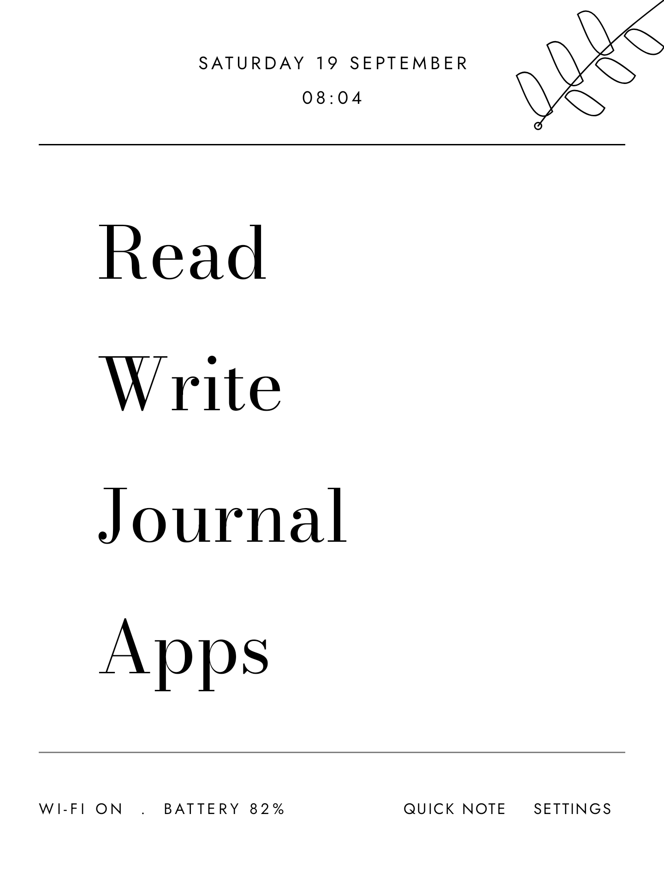
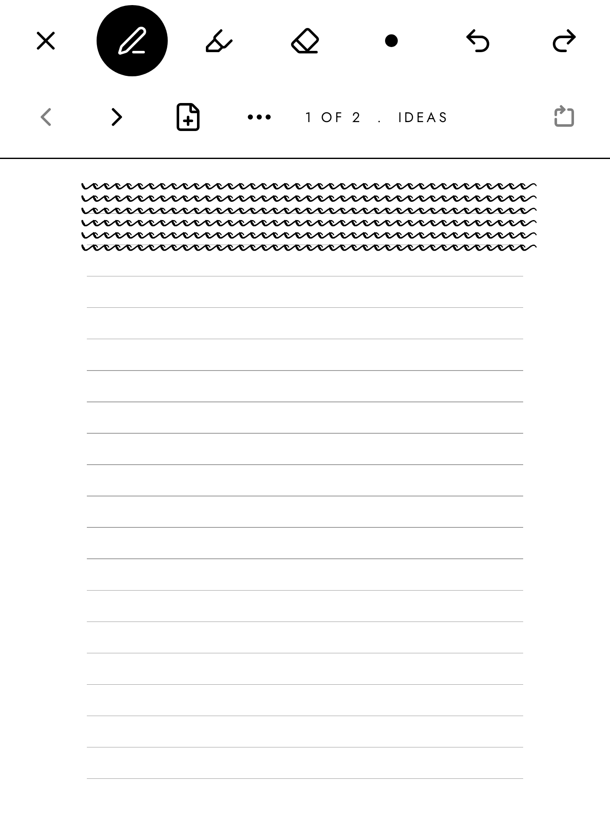

# Eink Launcher

[](https://github.com/FoxesRCool1/Eink-Launcher/actions/workflows/ci.yml)

An Android home screen for e-ink tablets. It replaces the launcher with a
calm, text first screen and four places to go: Read, Write, Journal and Apps.

"Eink Launcher" is a working name.

Made for the ViWoods AiPaper Mini (8.2 inch E Ink Carta 1000, 1440 x 1920,
Wacom EMR pen, Android 13). The `generic` build runs on any Android 10 or
newer device, with no ViWoods code in it.

| Today | Reading | Notes on a book |
| --- | --- | --- |
|  |  |  |

| Handwriting | Journal month |
| --- | --- |
|  |  |

The pictures come from the screenshot tests. The book text in them is the
opening of *Walden* by Henry David Thoreau (1854), which is in the public
domain.

## What it does

- **Today.** Date and time, four large words, battery and Wi-Fi, the next
  item of your routine, and a quick note.
- **Read.** Import EPUB and PDF files. EPUB: pages, not a scroll; font, size,
  margins and line spacing; highlights with typed notes or a handwritten note
  card. PDF: one screen of a page at a time, four zoom steps, crop margins,
  and the pen straight on the page. A reading timer and a daily goal.
- **Write.** Folders, typed Markdown notes with autosave and word count, and
  handwritten notebooks on blank, lined or dot grid pages. Export to PDF and
  PNG. Works with a Bluetooth keyboard.
- **Journal.** One entry a day, typed or handwritten. A month view. Habits
  with streaks. A routine for the day.
- **Apps.** Up to eight pinned apps as plain text, and every app from A to Z.

## How it is made for e-ink

- No animations. None. Not in page turns, dialogs, buttons or the text
  cursor.
- Pages, not scrolling. Every list has Previous and Next.
- Pure black on pure white. A press turns a control black at once.
- As few pixels as possible change at a time. The clock changes once a
  minute. The pen repaints only the small box around the newest piece of a
  line.

## Your files are yours

Everything you make is a plain file in one folder on the tablet:

```
EinkLauncher/
  books/          the EPUB and PDF files you imported
  annotations/    <book>.json, <book>/page-0001.strokes, reading-log.csv
  notes/          your folders, *.md typed, *.inknote handwritten
  journal/        2026/2026-09-20.md, 2026/2026-09-20.inknote
  habits/         habits.json, log.csv, routine.json
  exports/
```

Typed notes are Markdown. A handwritten note is a zip with a `meta.json`, the
strokes of each page and a PNG of each page. The stroke format is twenty
lines long and written down in `docs/decisions/0008-ink-engine.md`.

The app collects nothing. It goes online for one thing only, and only when
you press the button: to look for a new version of itself on GitHub and
download it. A book you read cannot go online at all.

## Install on a ViWoods tablet

`adb install` does not work on these tablets, so the APK goes over by file.

1. On the tablet, open the [Releases page](https://github.com/FoxesRCool1/Eink-Launcher/releases)
   in the browser and download `eink-launcher-<version>-viwoods.apk`. You can
   also copy the file over USB into the Download folder.
2. Open the file. Android asks whether the browser or the file manager may
   install apps. Allow it, then press Install.
3. Open Eink Launcher from the stock launcher.

While the app is being tested, take the file that ends in `-viwoods-debug.apk`.
It has the device test and the dev tools in it. A debug file and a release
file have different signing keys, so one does not install over the other:
stay with the kind you started with, or back up and uninstall first.

### Updates

Settings, then Help, then "Check for updates". The app looks at the GitHub
Releases of this project, and if there is a newer version it offers it. One
press downloads and installs. Android asks once for the permission to install,
and asks "update this app?" each time. Your notes, books and settings stay.

Right after an update, Android may show the stock launcher. Press the Home
key and Eink Launcher is back.

If the repository is private, GitHub hides its releases. The update screen
then asks for an access token: a fine-grained token, for this one repository,
with read access to "Contents". A public repository needs none.

### Make it the home screen

4. In Eink Launcher: Settings, then "Set as home". One of three things
   happens:
   - A system dialog asks which home app to use. Pick Eink Launcher.
   - A settings screen opens. Pick Eink Launcher there.
   - The app shows written steps. The stock ViWoods launcher hides the
     Android settings, so on some firmware this is the only way:
     1. Install **DevCheck** from the Play Store.
     2. Open DevCheck, go to the Apps tab and tap Eink Launcher.
     3. Tap Manage. The standard app info screen opens.
     4. Tap "Set as default", then "Home app", then Eink Launcher.
5. Press the Home key. You should land on Today.

### Go back to the stock launcher

You cannot get trapped. Apps, then the "Always available" block at the top of
the Pinned page, lists the stock launcher, the ViWoods settings app and the
Android settings. They are always there and cannot be unpinned.

To make the stock launcher the home screen again, do step 4 again and pick
the stock launcher (it is called WiskyLauncher), or uninstall Eink Launcher.
Your files stay where they are unless you uninstall: **back up first**, with
Settings, Storage, "Back up".

### Handwriting speed

A new app gets no help from the tablet with the pen, so ink lags behind the
pen tip. ViWoods tablets have a fast pen that this app can switch on through
undocumented calls. It is off until you have tried it: Settings, Help,
"Device test", then Settings, Pen. `PROGRESS.md` has the test list.

## Build it yourself

You need JDK 17 or newer and the Android SDK with platform 37. Android Studio
is not needed.

```
./gradlew assembleViwoodsDebug          # for a ViWoods tablet
./gradlew assembleGenericDebug          # for any other Android device
./gradlew testViwoodsDebugUnitTest      # unit tests, and the screenshots
./gradlew lintViwoodsDebug
```

The screenshots land in `app/build/outputs/roborazzi/` at 1440 x 1920, the
size of the panel.

To try it on the dev machine, in an Android emulator the size of the panel:

```
tools/emulator.sh
```

It needs the `emulator` and `system-images;android-33;google_apis;x86_64`
packages of the Android SDK, and KVM. The mouse draws on handwriting pages
there. It is not e-ink, so it shows layout and bugs, not ghosting.

To get a debug build onto the tablet:

```
tools/deploy.sh viwoods 8000
```

It builds the APK, serves it on the local network and prints the address.
Open that address in the tablet browser. A debug build can also fetch the
next build by itself: Settings, Help, "Design demo", Dev. That is for a build
that is not pushed yet.

To put a new version on GitHub, where the app finds it by itself:

```
tools/release.sh 0.1.1 "What changed, in one line."
```

It sets the version, writes the notes, commits, tags and pushes. GitHub
Actions builds the files and makes the release. `docs/RELEASING.md` has the
rest.

Two flavours:

- `viwoods` reaches the hidden ViWoods display and pen calls by reflection.
  Every call is guarded and none can crash the app. It targets SDK 30,
  because the fast pen is said to need that.
- `generic` has no vendor code and targets the newest SDK.

Where things are: `CLAUDE.md` has the rules of the code, `docs/HANDOFF.md`
the state of the work, `docs/decisions/` one short file per decision,
`PROGRESS.md` what works and what the owner still has to test, and
`docs/RELEASING.md` how a release is made.

## Credits

- The idea came from ["Prose: The distraction-free, e-ink laptop that should
  exist"](https://medium.com/this-should-exist/prose-a-distraction-free-e-ink-laptop-for-thinkers-writers-4182a62d63b2)
  by Micah Daigle. The article and its images are CC BY-SA 4.0. No image and
  no layout from it is copied, traced or reused here.
- What is known about the hidden ViWoods display and pen calls comes from the
  research in [`jdkruzr/ViwoodsAppDev`](https://github.com/jdkruzr/ViwoodsAppDev).
  That repository has no licence, so it was used as a reference only. No code
  from it is in this project.
- [Readium Kotlin Toolkit](https://github.com/readium/kotlin-toolkit), the
  EPUB engine. BSD 3-Clause.
- Fonts: Bodoni Moda, Jost and Literata, all SIL Open Font License 1.1.
- The corner drawing and the icon are original work for this project. No
  other art is used yet.

`ASSETS.md` lists every font and drawing with its source.
`licenses/DEPENDENCIES.md` lists every library with its licence.

## Licence

Apache-2.0. See `LICENSE`.
